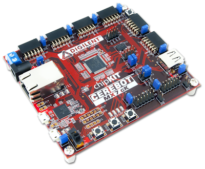

# Repo for Cerebot MX7 cK Design Files & Code

## Installation

1) Follow install instructions from [chipKIT core](https://chipkit.net/wiki/index.php?title=ChipKIT_core)
  + Uses [Arduino IDE](https://www.arduino.cc/en/guide/linux)
2) Add user permissions to access UART `$ sudo usermod -a -G dialout ${USER}` and `$ sudo usermod -a -G tty ${USER}`

Old [Digilent website](https://store.digilentinc.com/cerebot-mx7ck-retired/)
